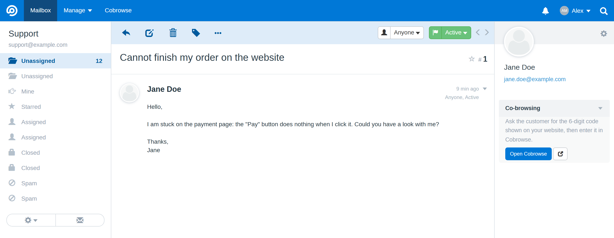
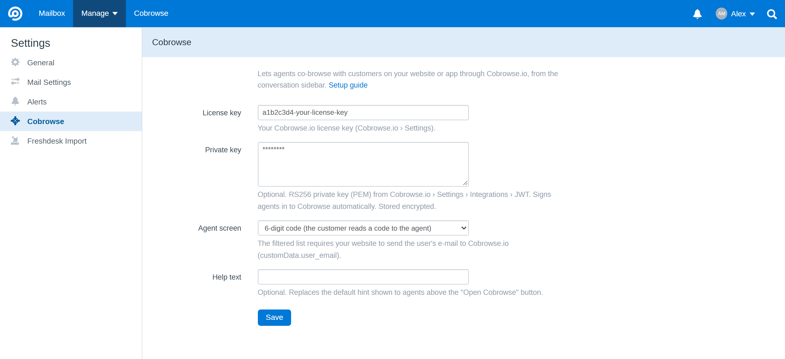

# Cobrowse.io integration for FreeScout

Co-browse with your customers without leaving the ticket. This [FreeScout](https://freescout.net) module adds a
**Co-browsing** block to the conversation sidebar that opens the [Cobrowse.io](https://cobrowse.io) agent screen in a
floating frame, plus a full-page Cobrowse.io dashboard.

- **Sidebar block** in every conversation, collapsed by default. The Cobrowse.io frame is only loaded when the agent
  clicks **Open Cobrowse**, so viewing a ticket makes no request to Cobrowse.io.
- **Floating frame**, bottom right, with **Maximize** (remembered per browser), **Full screen** and **Close**.
- **Three agent screens**: 6-digit code (the customer reads a code shown on your website), list of all connected
  devices, or list filtered on the customer's e-mail.
- **Automatic agent sign-in**: agents are signed in to Cobrowse.io with a JWT signed by your private key, so nobody
  has to log in to Cobrowse.io separately.
- **Full-page dashboard** at `/cobrowse`, linked from the top menu.
- English and French.

## Requirements

- FreeScout 1.8 or newer
- A [Cobrowse.io](https://cobrowse.io) account, and the Cobrowse.io SDK on your website or app (see below)

## Installation

1. Download this repository and copy it to `Modules/Cobrowse` in your FreeScout installation
   (the folder **must** be named `Cobrowse`).
2. In FreeScout, go to **Manage › Modules** and activate **Cobrowse**.
3. Go to **Manage › Settings › Cobrowse** and fill in your settings.

## Configuration

| Setting | Where to find it |
|---|---|
| **License key** | Cobrowse.io › Settings. Required: without it the module stays hidden. |
| **Private key** (optional) | Cobrowse.io › Settings › Integrations › JWT: generate a key pair, paste the **private** key (PEM) here and keep the public key in Cobrowse.io. Enables automatic agent sign-in. Stored encrypted. |
| **Agent screen** | `6-digit code` (default), `Device list`, or `Device list filtered on the customer's e-mail`. |
| **Help text** (optional) | Replaces the hint shown to agents above the **Open Cobrowse** button, e.g. where the customer finds the code on your website. |

The same values can also be set in `.env` (`COBROWSE_LICENSE`, `COBROWSE_PRIVATE_KEY` = path to the PEM file,
`COBROWSE_EMBED`, `COBROWSE_HELP_TEXT`); the settings page takes precedence.

### On your website

Add the Cobrowse.io SDK to your website or app ([Cobrowse.io documentation](https://docs.cobrowse.io)).

- With the **6-digit code** screen, give customers a way to display a code, e.g. a "Co-browse with support" button that
  calls `CobrowseIO.createSessionCode()`.
- With the **filtered device list**, send the signed-in user's e-mail to Cobrowse.io as
  `CobrowseIO.customData = { user_email: '...' }`: the list is then filtered on the e-mail of the ticket's customer.

## How it works

- The sidebar block uses FreeScout's `conversation.after_customer_sidebar` hook; scripts and styles are loaded as files
  (FreeScout's Content-Security-Policy blocks inline scripts).
- The agent JWT is signed server-side with `openssl_sign` (RS256), valid for 8 hours, with the claims required by
  Cobrowse.io (`iss` = license key, `sub` = agent e-mail, `displayName`, `aud`). No external dependency.

## License

[AGPL-3.0](LICENSE), like FreeScout.

Cobrowse.io is a trademark of its owner. This module is an independent integration, not affiliated with or endorsed
by Cobrowse.io.
